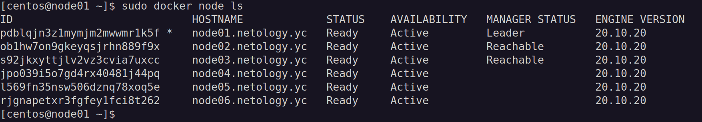
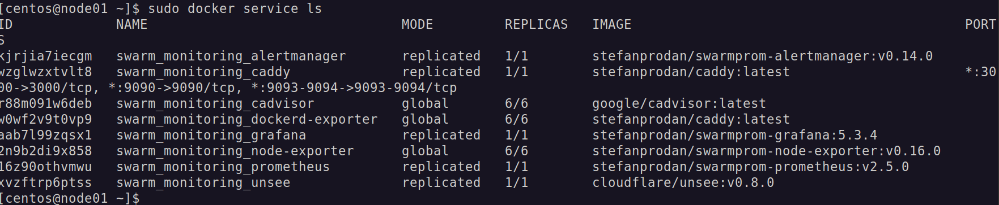

# devops-DZ5.5-Docker-Swarm
# Домашнее задание к занятию "5.5. Оркестрация кластером Docker контейнеров на примере Docker Swarm"

## Задача 1

Дайте письменые ответы на следующие вопросы:

- В чём отличие режимов работы сервисов в Docker Swarm кластере: replication и global?
- Какой алгоритм выбора лидера используется в Docker Swarm кластере?
- Что такое Overlay Network?

## Ответ

   * replication создаёт заданное количество контейнеров, а global создаёт по одному контейнеру на каждом узле.
   В режиме replication мы явно указываем количество реплик сервиса, которые хотим запустить. В режиме global запускается одна реплика на каждом узле, заранее заданного количества реплик нет.
   * В Docker Swarm кластере используется так называемый алгоритм поддержания распределенного консенсуса — Raft. Выбор лидера происходит следующим образом: если ноды-фолловеры не слышат лидера, они переходят в статус кандидата, кандидат на лидера отправляет остальным нодам запрос на голосование, большинством голосов выбирается лидер.
   * Overlay Network - внутренная сеть кластера Docker Swarm которая соединяет между собой сети различных узлов кластера. 

## Задача 2

Создать ваш первый Docker Swarm кластер в Яндекс.Облаке

Для получения зачета, вам необходимо предоставить скриншот из терминала (консоли), с выводом команды:
```
docker node ls
```
## Ответ



## Задача 3

Создать ваш первый, готовый к боевой эксплуатации кластер мониторинга, состоящий из стека микросервисов.

Для получения зачета, вам необходимо предоставить скриншот из терминала (консоли), с выводом команды:
```
docker service ls
```
## Ответ


